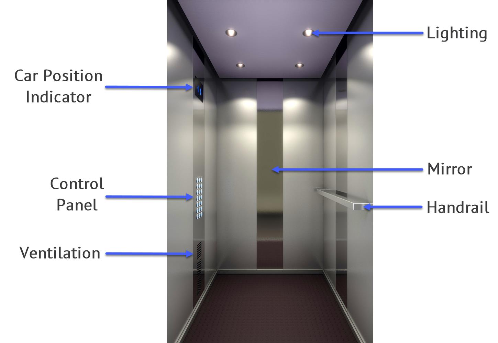

Inside the car
--------------

The following diagram shows the interior of the car.

   
* **Car position indicator** is a LED screen displaying number of the floor where the car is currently on, and an arrow pointing the direction of the car movement.
* **Control panel** is a board with buttons for control of the car movement and operation (see :doc:`control-panel`).
* **Ventilation** is used to maintain normal temperature and keep the air fresh.
* **Lighting** consists of four LED downlights providing bright but soft illumination.
* **Mirror** is used to take passengers’ time while they travel between floors.
* **Handrail** provides support for passengers who have disabilities or experience difficulties in balance.
