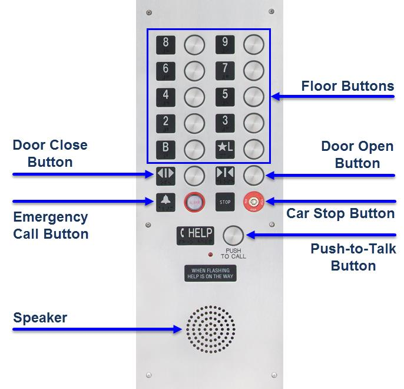

Control panel
-------------

The following diagram shows the control panel. To the left of every button there is a LED indicator. The indicator lights up after a passenger presses the corresponding button.

   
* **Floor buttons** are pressed to make the car go to the destination floor.
* **Door close button** and **Door open button** are pressed to force the elevator door to close and open.
* **Emergency call button** is pressed to call for help in case of an emergency situation.
* **Car stop button** is pressed to make the car stop.
* **Push-to-talk button** is a button you press when you talk to emergency personnel.
* **Speaker** is a device which delivers speech coming from emergency personnel.
