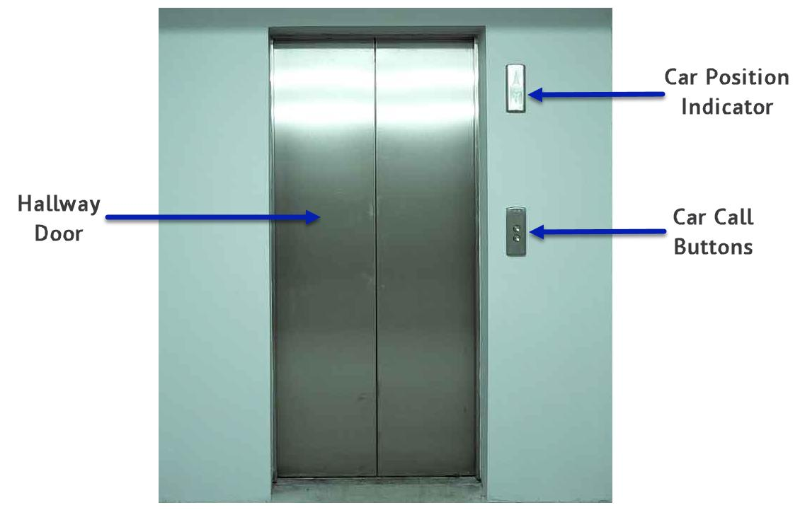

Elevator Entrance
-----------------

You can find an entrance into the elevator on every floor. The following diagram shows how this entrance looks like.

* **Hallway door** is a sliding door which opens automatically when the car arrives to the floor so that passengers can enter into the car or leave it.
* **Car position indicator** is a LED screen displaying a number of the floor where the car is currently on, and an arrow pointing the direction of the car movement.
* **Car call buttons** are two buttons passengers press, when they want the car to move to the floor they are currently on. Depending on the destination floor, a passenger should press either the upper (↑) or lower (↓) button. 
